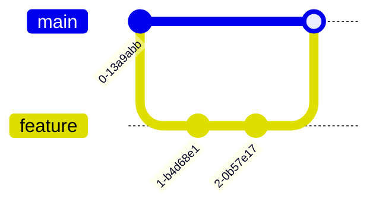
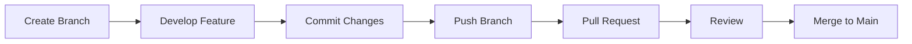
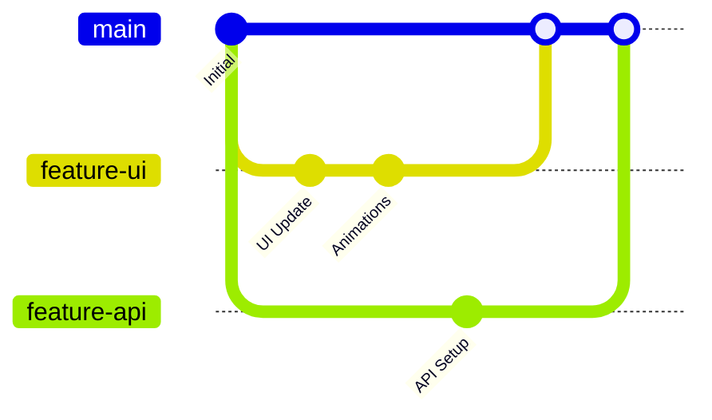

# 🚀 Git Branch Merging Workflow

<div align="center">


 
### ⚡ Professional Git Branching & Merging Guide

</div>

---

# 🌟 What is Branch Merging?

Branch merging means combining changes from one branch into another.

Example:

```bash
feature-login  ➜  main
```

This helps developers:

* Work safely
* Build features separately
* Avoid breaking the main project
* Collaborate professionally

---

# 🧠 Basic Workflow



---

# 📂 Step 1 — Create New Branch

```bash
git checkout -b feature-navbar
```

✨ Creates and switches to new branch.

---

# ⚡ Step 2 — Work on Feature

```bash
git add .
git commit -m "Added animated navbar"
```

---

# 🔥 Step 3 — Switch Back to Main

```bash
git checkout main
```

---

# 🚀 Step 4 — Merge Branch

```bash
git merge feature-navbar
```

✅ Your feature is now merged into main branch.

---

# 🗑️ Step 5 — Delete Branch (Optional)

```bash
git branch -d feature-navbar
```

---

# 🌌 Professional Merge Workflow



---

# ⚠️ Merge Conflict Example

Sometimes Git shows:

```bash
CONFLICT (content): Merge conflict in app.js
```

This means:

* Two branches edited same code
* Git needs manual decision

---

# 🛠️ Resolve Conflict

Open file and fix:

```bash
<<<<<<< HEAD
Old Code
=======
New Code
>>>>>>> feature-branch
```

Then:

```bash
git add .
git commit -m "Resolved merge conflict"
```

---

# 🎯 Best Practices

✅ Use small branches
✅ Commit frequently
✅ Pull latest changes before merging
✅ Use meaningful commit messages
✅ Delete unused branches

---

# 💻 Useful Commands

| Command                    | Purpose       |
| -------------------------- | ------------- |
| `git branch`               | Show branches |
| `git checkout branch-name` | Switch branch |
| `git checkout -b name`     | Create branch |
| `git merge branch-name`    | Merge branch  |
| `git branch -d name`       | Delete branch |

---

# 🌟 Advanced Workflow



---

# 🧑‍💻 Example Real Workflow

```bash
git checkout -b feature-auth

git add .
git commit -m "Built login page"

git push origin feature-auth

git checkout main

git merge feature-auth
```

---

# 🚀 Final Result

✅ Organized code
✅ Safe development
✅ Team collaboration
✅ Professional workflow
✅ Easy feature management

---

<div align="center">

# ⭐ Happy Coding ⭐

### Built with ❤️ using Git & GitHub by GD Team PVT.LTD

</div>
